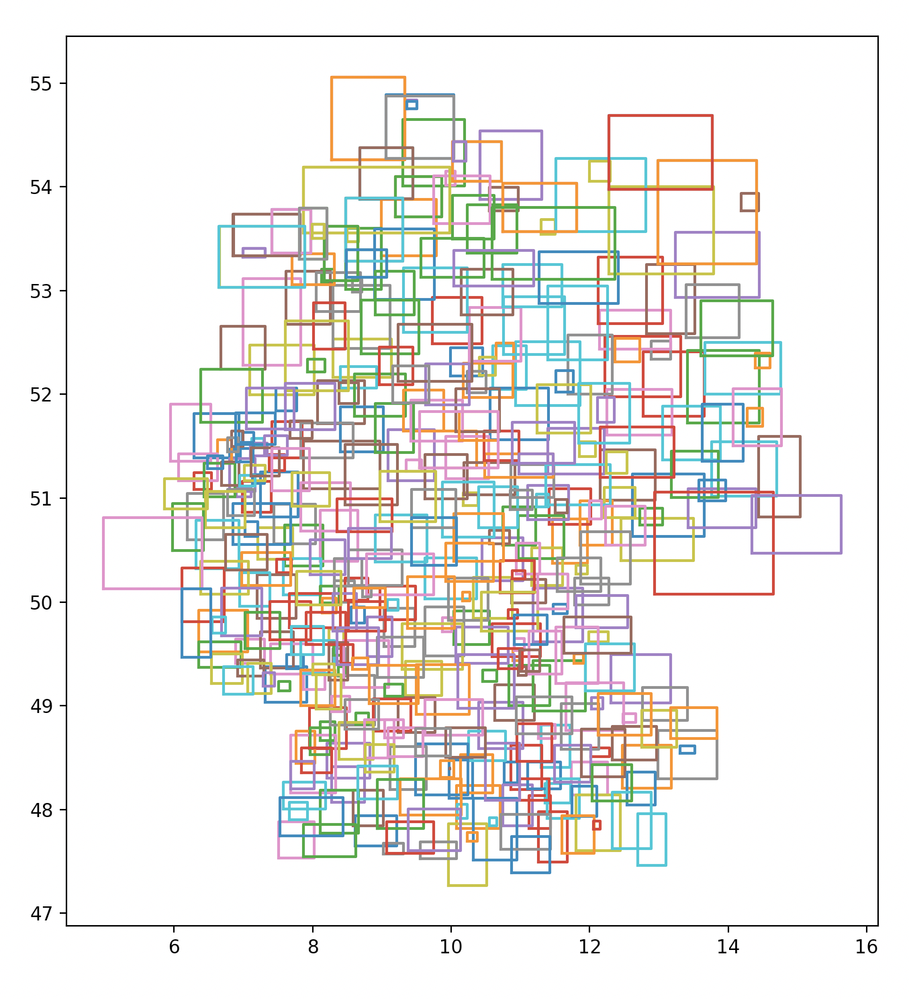

# Main Crawler verwenden
Ausführen: `mainCrawler.py [-h] [-a] [-d] [-o]`

Crawl all (or specific) data sources. Choose one of the corresponding flags:
  
  `-h`, `--help`   show this help message and exit
  
  `-a`, `--all`    crawl ALL data sources
  
  `-d`, `--daily`  only crawl data sources that need to be updated daily
  
  `-o`, `--once`   only crawl data sources that need to be accessed rarely or only once

# Neue Child Crawler Klasse hinzufügen

1. Kopiere `crawlerExample.py` und benenne die Datei entsprechnd dem neuen Crawler
2. Ändere den Klassennamen, den menschenlesbaren Namen in Variable `name`, Beschreibungstext etc.
3. Füge den Code des eigentlichen Crawljobs zur Methode `crawl()` hinzu
4. In `mainCrawler.py` füge eine `import`-Anweisung hinzu:

    `from crawlers.crawler_file_name import NewCrawlerClass`
    
5. In `mainCrawler.py` erweitere `crawler_dict` um einen Eintrag zum neunen Crawler:
    
    ```
    {
        'class':     NewCrawlerClass,
        'frequency': 'once | daily'
    },
    ```
    - Verwende `daily`, wenn es eine Datenquelle ist, die sich täglich ändert bzw. erweitert wird
    - Verwende `once`, wenn sie nur einmal oder sehr selten abgerufen werden soll

# Crawler for Distanzen zwischen den Landkreisen
**Idee:** Um jedem Landkreis wird eine Bounding Box gezogen, der Mittelpunkt bestimmt, und dann wird die Entfernungen zwischen den Punkten in eine Matrix eingetragen.
So kann die mit dem Abständen gewichteten Fallzahlen der benachbarten Landkreise bei der Betrachtung der Situation in einem Landkreis berücksichtigt werden.



Die fertige Tabelle befindet sich unter `/daten/prepared/lk_distance_matrix.tsv`.
